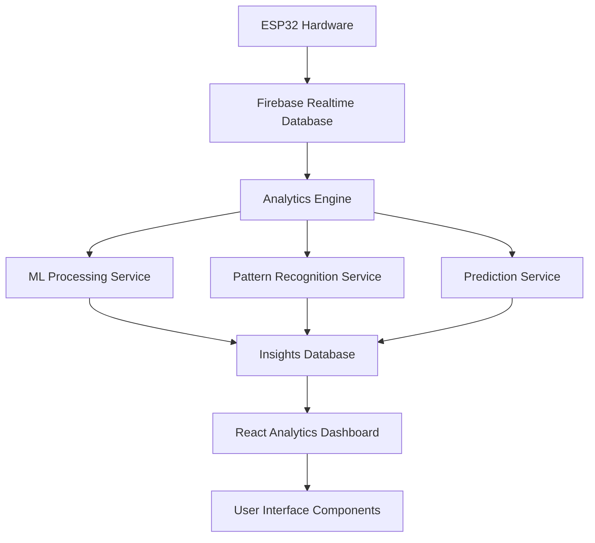

# Technical Design Specification: Analytics Module

## Executive Summary

This document presents the technical architecture and implementation strategy for the NoteNetra Analytics Module. The system leverages transaction data captured by ESP32-based currency detection hardware to deliver intelligent financial insights through statistical analysis, pattern recognition, and predictive modeling.

The architecture integrates seamlessly with the existing technology stack (React frontend, Firebase backend) while introducing new analytical capabilities through modular service components. The design prioritizes scalability, maintainability, and user experience while ensuring data privacy and system reliability.

## Architecture

### High-Level Architecture



### System Architecture

The analytics module follows a layered architecture pattern with clear separation of concerns:

1. **Data Acquisition Layer**: Existing ESP32 hardware sensors with Firebase Realtime Database integration
2. **Analytics Processing Layer**: Core computational engine for transaction analysis and insight generation
3. **Intelligence Layer**: Statistical algorithms and pattern recognition services for advanced analytics
4. **Persistence Layer**: Firebase Firestore for structured storage of computed insights and user preferences
5. **Presentation Layer**: React-based user interface components with responsive design and real-time updates

## Components and Interfaces

### 1. Analytics Engine Service

**Purpose**: Serves as the central orchestration layer for all analytical operations, coordinating data retrieval, processing, and insight generation.

**Core Methods**:
- `analyzeTransactionPatterns(userId: string, timeRange: TimeRange): Promise<PatternAnalysis>` - Performs comprehensive pattern analysis across specified time periods
- `generateSpendingInsights(transactions: Transaction[]): Promise<Insight[]>` - Transforms raw transaction data into human-readable insights with contextual recommendations
- `detectAnomalies(transactions: Transaction[]): Promise<Anomaly[]>` - Identifies statistical outliers and unusual spending patterns
- `categorizeTransaction(transaction: Transaction): Promise<CategoryPrediction>` - Applies classification logic to assign transaction categories

**Processing Pipeline**:
1. Retrieves transaction data from Firebase Realtime Database with appropriate filtering
2. Applies data normalization and validation to ensure consistency
3. Executes analytical algorithms through specialized service modules
4. Persists generated insights to Firestore for efficient retrieval
5. Triggers notification system for time-sensitive insights requiring user attention

### 2. Pattern Recognition Service

**Purpose**: Implements statistical and algorithmic approaches to identify meaningful patterns in transaction data, enabling trend detection and behavioral analysis.

**Analytical Techniques**:
- **Time-Series Analysis**: Applies moving averages and trend decomposition to identify spending trajectories
- **Clustering Algorithms**: Groups similar transactions using k-means clustering for category inference
- **Anomaly Detection**: Utilizes z-score analysis and interquartile range methods to flag outliers
- **Temporal Pattern Recognition**: Identifies day-of-week, time-of-day, and seasonal spending patterns

**Deliverables**:
- Granular spending pattern analysis (daily, weekly, monthly aggregations)
- Anomaly reports with severity classification and contextual explanations
- Spending velocity metrics indicating rate of cash flow changes
- Trend indicators showing directional movement in spending behavior

### 3. Prediction Service

**Purpose**: Generates forward-looking forecasts of spending behavior and cash position using statistical modeling and historical pattern analysis.

**Forecasting Methodologies**:
- **Linear Regression Models**: Establishes baseline trend projections for spending patterns
- **Moving Average Calculations**: Provides short-term forecasts smoothing out random fluctuations
- **Seasonal Decomposition**: Accounts for recurring patterns (festivals, monthly cycles) in predictions
- **Rule-Based Recommendation Engine**: Generates actionable suggestions based on predicted outcomes

**Output Specifications**:
- 7-day and 30-day spending forecasts with confidence intervals
- Cash flow projections showing expected balance trajectory
- Budget recommendations calibrated to historical spending patterns
- Goal achievement probability assessments with risk factors

### 4. Frontend Analytics Components

#### AnalyticsDashboard Component
- Main container for all analytics views
- Navigation between different insight types
- Real-time data updates

#### InsightsPanel Component
- Displays AI-generated insights
- Interactive charts and visualizations
- Actionable recommendations

#### PredictionView Component
- Shows future spending forecasts
- Confidence intervals for predictions
- Scenario planning tools

#### GoalTracker Component
- Budget goal setting and tracking
- Progress visualization
- Achievement notifications

## Data Models

### Enhanced Transaction Model
```javascript
{
  id: string,
  userId: string,
  timestamp: string,
  amount: number,
  type: 'credit' | 'debit',
  mode: 'cash',
  deviceId: string,
  // New AI fields
  category: string,
  categoryConfidence: number,
  isAnomaly: boolean,
  anomalyScore: number,
  tags: string[]
}
```

### Analytics Insights Model
```javascript
{
  userId: string,
  generatedAt: timestamp,
  timeRange: string,
  insights: {
    spendingTrends: {
      dailyAverage: number,
      weeklyTrend: 'increasing' | 'decreasing' | 'stable',
      monthlyComparison: number
    },
    categories: {
      [category]: {
        amount: number,
        percentage: number,
        trend: string
      }
    },
    anomalies: [
      {
        transactionId: string,
        reason: string,
        severity: 'low' | 'medium' | 'high'
      }
    ],
    recommendations: [
      {
        type: string,
        message: string,
        priority: number
      }
    ]
  }
}
```

### Prediction Model
```javascript
{
  userId: string,
  generatedAt: timestamp,
  predictions: {
    nextWeek: {
      expectedSpending: number,
      confidence: number,
      range: { min: number, max: number }
    },
    nextMonth: {
      expectedSpending: number,
      confidence: number,
      range: { min: number, max: number }
    },
    cashFlowForecast: [
      {
        date: string,
        predictedBalance: number,
        confidence: number
      }
    ]
  }
}
```

### Goal Tracking Model
```javascript
{
  userId: string,
  goalId: string,
  type: 'spending_limit' | 'saving_target',
  amount: number,
  period: 'daily' | 'weekly' | 'monthly',
  startDate: string,
  endDate: string,
  currentProgress: number,
  status: 'active' | 'completed' | 'exceeded',
  notifications: boolean
}
```

## Error Handling

### Data Processing Failures
- **Insufficient Data Scenarios**: Display user-friendly messaging when transaction history is inadequate for statistical analysis (minimum thresholds not met)
- **Algorithm Execution Failures**: Implement graceful degradation to basic statistical summaries (mean, median, totals) when advanced algorithms encounter errors
- **Database Connectivity Issues**: Deploy automatic retry logic with exponential backoff and offline capability using cached data

### User Experience Considerations
- **Loading States**: Implement skeleton screens and progress indicators during computational operations to maintain user engagement
- **Timeout Management**: Establish reasonable processing time limits (5-10 seconds) with user notification if exceeded
- **Graceful Degradation**: Ensure partial functionality remains available when specific features encounter errors, displaying basic metrics as fallback

### Error Recovery Strategies
- Automatic retry for transient failures
- Fallback to cached insights when real-time processing fails
- User notification for persistent issues with suggested actions

## Testing Strategy

### Unit Testing
- **Analytics Engine**: Test individual insight generation functions
- **ML Services**: Validate pattern recognition algorithms with known datasets
- **React Components**: Test component rendering and user interactions
- **Data Models**: Validate data transformation and validation logic

### Integration Testing
- **Firebase Integration**: Test data flow from ESP32 to analytics engine
- **End-to-End Analytics**: Verify complete insight generation pipeline
- **Real-time Updates**: Test live data processing and UI updates

### Performance Testing
- **Large Dataset Processing**: Test with months of transaction data
- **Concurrent User Load**: Simulate multiple users generating insights
- **Memory Usage**: Monitor ML algorithm memory consumption
- **Response Times**: Ensure insights load within acceptable timeframes

### User Acceptance Testing
- **Insight Accuracy**: Validate that generated insights make sense to users
- **Recommendation Quality**: Test usefulness of AI recommendations
- **UI/UX Flow**: Ensure smooth user experience across all analytics features

## Implementation Considerations

### Performance Optimization
- **Caching Strategy**: Cache frequently accessed insights in Firestore
- **Lazy Loading**: Load analytics components only when needed
- **Background Processing**: Process insights asynchronously to avoid UI blocking
- **Data Pagination**: Implement pagination for large transaction datasets

### Security and Privacy
- **Data Encryption**: Encrypt sensitive financial data in transit and at rest
- **User Consent**: Implement clear consent mechanisms for AI processing
- **Data Retention**: Define retention policies for analytics data
- **Access Control**: Ensure users can only access their own analytics

### Scalability
- **Microservices Architecture**: Design analytics services to scale independently
- **Database Optimization**: Use appropriate indexes for analytics queries
- **CDN Integration**: Cache static analytics assets for faster loading
- **Load Balancing**: Distribute analytics processing across multiple instances

### Monitoring and Observability
- **Analytics Metrics**: Track insight generation success rates and performance
- **User Engagement**: Monitor which analytics features are most used
- **Error Tracking**: Implement comprehensive error logging and alerting
- **Performance Monitoring**: Track response times and resource usage